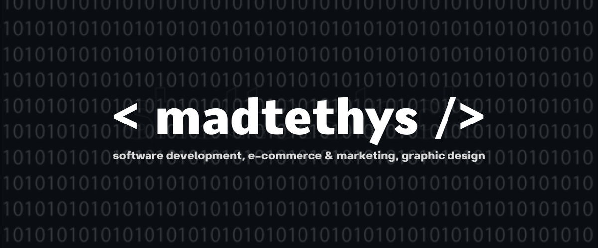

<h2 align="center" style="color:#e63946;text-shadow: 3px 4px 4px rgba(205, 50, 70, 0.7);">Selam, ben Mustafa Arda. Profilime hoş geldiniz.  </h2>
</img>

    
    

    

 

## ✒️ Hakkımda
Küçük yaşlardan beri bilgisayarla iç içe büyüdüm ve zamanla bu ilgim, yazılım, grafik tasarım ve e-ticaret gibi alanlarda derin bir tutkuya dönüştü. Bugün, bu alanlarda edindiğim bilgi ve becerilerle markaların dijital dünyada fark yaratmalarına yardımcı oluyorum.

Kodlama benim için her zaman bir tutku olmuştur. Çocukluk yıllarımda başladığım bu serüven, bugüne kadar çeşitli projelerle gelişmeye devam etti. Kullanıcı dostu ve işlevsel yazılımlar, web siteleri ve uygulamalar geliştiriyorum. Hedefim her zaman teknik olarak güçlü, kullanımı kolay ve estetik açıdan da göze hitap eden çözümler üretmek. Hem MAC hem de Windows platformlarında çalışarak farklı projeler yürüttüm.

Grafik tasarım ise bir diğer güçlü yanım. Photoshop, Illustrator ve diğer tasarım araçlarında oldukça deneyimliyim. Logo tasarımından kurumsal kimliğe, afiş ve broşürlerden kartvizitlere kadar birçok farklı projede yer aldım. Tasarımlarımı yaparken sadeliğe ve işlevselliğe önem veriyor, renkler ve perspektifle oynayarak görsel açıdan etkileyici işler ortaya koyuyorum. Soyut fikirlerinizi alıp profesyonel bir yaklaşımla somut bir şekilde hayata geçirmeyi seviyorum.

Ayrıca, e-ticaret alanında da faaliyet gösteriyorum. İşletmelerin dijital dünyada varlıklarını büyütmeleri için e-ticaret platformları geliştiriyor, dijital pazarlama stratejileri oluşturarak onların satışlarını artırmalarına yardımcı oluyorum. Teknoloji ve tasarımı bir arada kullanarak markaların dijital dünyada daha fazla ses getirmelerini sağlamak benim en büyük hedefim.

## 🚀 Yazılım Geliştirme
> Diller ve Teknolojiler: [Python, JavaScript, PHP, Swift]

> Araçlar: [React, Node.js, NextJS]
 
> Projeler: Web uygulamaları, mobil uygulamalar, API geliştirme
 
> Deneyim: **8 yıl**lık deneyimim var ve sürekli olarak en iyi uygulama standartlarını takip ederek yenilikçi çözümler üretmeye odaklanıyorum.

## 🎨 Grafik Tasarım
> Yazılımlar: [Adobe Photoshop, Adobe Illustrator, Adobe Lightroom, Adobe InDesign]

> Alanlar: Logo tasarımı, kullanıcı arayüzü (UI) tasarımı, kurumsal kimlik oluşturma
 
> Projeler: Markalar için yaratıcı ve etkili görsel çözümler, kullanıcı deneyimini iyileştiren tasarımlar

## 🛒 E-Ticaret ve Pazarlama
> Deneyim: E-ticaret platformlarının kurulumu ve yönetimi, dijital pazarlama stratejileri geliştirme

> Araçlar: [Shopify, WooCommerce, Prestashop, Opencart]

> Uzmanlık: Ürün listeleme, SEO optimizasyonu, sosyal medya yönetimi, kampanya planlama ve analiz

## 🎵 Spotify Son Dinlediğim Müzikler
> Kendi yaptığım Spotify Son Dinlediğim Müzikler projem

## 📈 GitHub İstatistiklerim
 

## 🎯 İlgi Alanlarım

